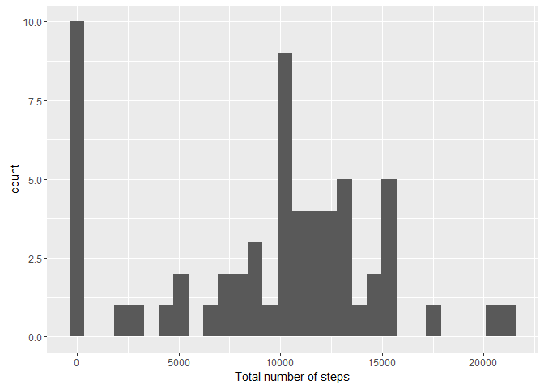
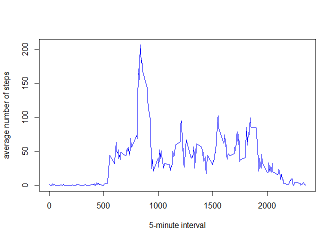
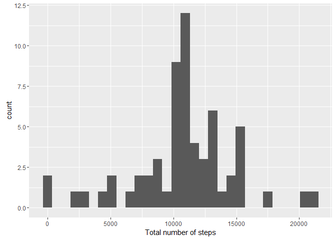
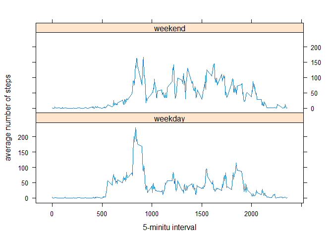

# Reproducible Research: Peer Assessment 1

## Loading and preprocessing the data

```r
activity <- read.csv("activity.csv")
str(activity)
```

```
## 'data.frame':	17568 obs. of  3 variables:
##  $ steps   : int  NA NA NA NA NA NA NA NA NA NA ...
##  $ date    : Factor w/ 61 levels "2012-10-01","2012-10-02",..: 1 1 1 1 1 1 1 1 1 1 ...
##  $ interval: int  0 5 10 15 20 25 30 35 40 45 ...
```

```r
head(activity)
```

```
##   steps       date interval
## 1    NA 2012-10-01        0
## 2    NA 2012-10-01        5
## 3    NA 2012-10-01       10
## 4    NA 2012-10-01       15
## 5    NA 2012-10-01       20
## 6    NA 2012-10-01       25
```

```r
summary(activity)
```

```
##      steps                date          interval     
##  Min.   :  0.00   2012-10-01:  288   Min.   :   0.0  
##  1st Qu.:  0.00   2012-10-02:  288   1st Qu.: 588.8  
##  Median :  0.00   2012-10-03:  288   Median :1177.5  
##  Mean   : 37.38   2012-10-04:  288   Mean   :1177.5  
##  3rd Qu.: 12.00   2012-10-05:  288   3rd Qu.:1766.2  
##  Max.   :806.00   2012-10-06:  288   Max.   :2355.0  
##  NA's   :2304     (Other)   :15840
```


## What is mean total number of steps taken per day?

(ignore the missing values in the dataset.)

- Make a histogram of the total number of steps taken each day

```r
total_steps <- aggregate(activity$steps, list(date = activity$date), sum, na.rm=TRUE)
colnames(total_steps)[2] <- "totalsteps"
library(ggplot2)
ggplot(total_steps, aes(x=totalsteps)) + geom_histogram() + labs(x = "Total number of steps")
```

```
## `stat_bin()` using `bins = 30`. Pick better value with `binwidth`.
```




- Calculate and report the mean and median total number of steps taken per day

mean :

```r
mean(total_steps[[2]])
```

```
## [1] 9354.23
```

median : 

```r
median(total_steps[[2]])
```

```
## [1] 10395
```


## What is the average daily activity pattern?

- Make a time series plot (i.e. type = "l") of the 5-minute interval (x-axis) and the average number of steps taken, averaged across all days (y-axis)

```r
interval_mean <- aggregate(activity$steps, list(interval = activity$interval), mean, na.rm=TRUE)
colnames(interval_mean)[2] <- "mean_steps"
with(interval_mean, plot(interval, mean_steps, type="l", xlab="5-minute interval",
                         ylab="average number of steps", col="blue")) 
```



- Which 5-minute interval, on average across all the days in the dataset, contains the maximum number of steps?

```r
interval_mean$interval[which.max(interval_mean$mean_steps)]
```

```
## [1] 835
```


## Imputing missing values

(Note that there are a number of days/intervals where there are missing values (coded as NA). The presence of missing days may introduce bias into some calculations or summaries of the data.)

- Calculate and report the total number of missing values in the dataset (i.e. the total number of rows with NAs)

```r
na_count <- is.na(activity$steps)
# total number of missing values
length(activity$steps[na_count])
```

```
## [1] 2304
```


- Devise a strategy for filling in all of the missing values in the dataset. The strategy does not need to be sophisticated. For example, you could use the mean/median for that day, or the mean for that 5-minute interval, etc.

```r
# the strategy for filling in all of the missing values: Use mean of 5-minute interval across all the days
```


- Create a new dataset that is equal to the original dataset but with the missing data filled in.

```r
na_df <- subset(activity, is.na(activity$steps))
new_activity <- subset(activity, !is.na(activity$steps))

fill_df <- merge(na_df, interval_mean, by = "interval", all.x = TRUE)
fill_df$steps <- round(fill_df$mean_steps)
fill_df <- fill_df[,c(1:3)]

new_activity <- rbind(new_activity, fill_df)
new_activity <- new_activity[with(new_activity, order(date, interval)),]
head(new_activity)
```

```
##        steps       date interval
## 152651     2 2012-10-01        0
## 152741     0 2012-10-01        5
## 152811     0 2012-10-01       10
## 152931     0 2012-10-01       15
## 152971     0 2012-10-01       20
## 153091     2 2012-10-01       25
```


- Make a histogram of the total number of steps taken each day and Calculate and report the mean and median total number of steps taken per day. 

```r
new_total_steps <- aggregate(new_activity$steps, list(date = new_activity$date), sum)
colnames(new_total_steps)[2] <- "totalsteps"
ggplot(new_total_steps, aes(x=totalsteps)) + geom_histogram() + labs(x = "Total number of steps")
```

```
## `stat_bin()` using `bins = 30`. Pick better value with `binwidth`.
```



mean :

```r
mean(new_total_steps[[2]])
```

```
## [1] 10765.64
```

median : 

```r
median(new_total_steps[[2]])
```

```
## [1] 10762
```


Do these values differ from the estimates from the first part of the assignment? What is the impact of imputing missing data on the estimates of the total daily number of steps?

```r
# After Imputing missing values, the total number of steps taken each and the mean and median total number
# of steps taken per day are different from the first part of the assignment.
# The estimates of total daily number of steps should be more precise if having a suitable strategy for
# imputing missing data.
```


## Are there differences in activity patterns between weekdays and weekends?

(For this part the weekdays() function may be of some help here. Use the dataset with the filled-in missing values for this part.)

- Create a new factor variable in the dataset with two levels ?V ??weekday?? and ??weekend?? indicating whether a given date is a weekday or weekend day.

```r
new_activity$date <- as.Date(new_activity$date)
Sys.setlocale("LC_TIME", "C")
```

```
## [1] "C"
```

```r
new_activity$week <-weekdays(new_activity$date)
new_activity$week <- factor(new_activity$week)

library(plyr)
```

```
## Warning: package 'plyr' was built under R version 3.2.5
```

```r
new_activity$week <- revalue(new_activity$week, c("Monday" = "weekday", "Tuesday" = "weekday", 
                     "Wednesday" = "weekday", "Thursday" = "weekday", "Friday" = "weekday", 
                     "Saturday"="weekend", "Sunday"="weekend"))
```

- Make a panel plot containing a time series plot (i.e. type = "l") of the 5-minute interval (x-axis) and the average number of steps taken, averaged across all weekday days or weekend days (y-axis). 

```r
new_aggdata_mean <- aggregate(new_activity$steps, list(week =new_activity$week, 
                                                       interval = new_activity$interval), mean)
colnames(new_aggdata_mean)[3] <- "steps"

library(lattice)
```

```
## Warning: package 'lattice' was built under R version 3.2.5
```

```r
xyplot(steps ~ interval | week, data = new_aggdata_mean, type="l" , layout = c(1, 2), 
       xlab="5-minitu interval", ylab = "average number of steps")
```



